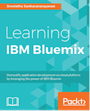

```
Roberto Nogueira  
BSd EE, MSd CE
Solution Integrator Experienced - Certified by Ericsson
```
# eBook Learning Ibm Bluemix



**About**

Learn everything you need to about the subject of this `eBook Learning Ibm Bluemix` project.

[Homepage](https://www.packtpub.com/virtualization-and-cloud/learning-ibm-bluemix)

## Topics
```
Table of Contents

[ ] 1: SAYING HELLO TO IBM BLUEMIX
[ ] 2: BUILDING AND DEPLOYING YOUR FIRST APPLICATION ON IBM BLUEMIX
[ ] 3: EXTENDING AN APPLICATION AND CONFIGURING FOR CONTINUOUS DELIVERY USING DEVOPS SERVICES
[ ] 4: LEVERAGING ON-PREMISE SOFTWARE FOR APPLICATIONS ON BLUEMIX
[ ] 5: SCALING APPLICATIONS IN BLUEMIX
[ ] 6: MONITORING AND MANAGEMENT IN BLUEMIX
[ ] 7: COMPUTE OPTIONS ON BLUEMIX
[ ] 8: SECURITY SERVICES ON BLUEMIX
[ ] 9: MICROSERVICES-BASED APPLICATION DEVELOPMENT ON BLUEMIX
[ ] 10: MOBILE APPLICATION DEVELOPMENT ON BLUEMIX
```
